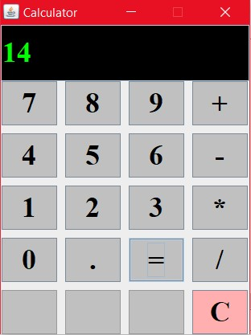

<div align="center">

  <h1>Java Swing Calculator</h1>

  
  
  

</div>


### A simple calculator built using Java Swing with a clean GUI. This calculator performs basic arithmetic operations (addition, subtraction, multiplication, division) and uses Java's `Stack` for operator handling.

---

## 🖥️ Features

- Basic arithmetic operations: `+`, `-`, `*`, `/`
- Stack-based expression handling
- Java Swing GUI with number and operator buttons
- Supports decimal inputs
- Displays result with smart formatting (rounded or decimal)
- "C" button to clear the screen and reset memory

---
| Screenshot 1 | Screenshot 2 |
|--------------|--------------|
|  |  |

---
## 🛠️ Requirements

- Java JDK 1.7 or later
- NetBeans IDE 8.0.2 (or compatible IDE with JDK 1.7 support)

---

## 🚀 How to Run

1. **Clone the repository**  
   ```bash
   git clone https://github.com/your-username/JavaSwingCalculator.git
   cd JavaSwingCalculator
